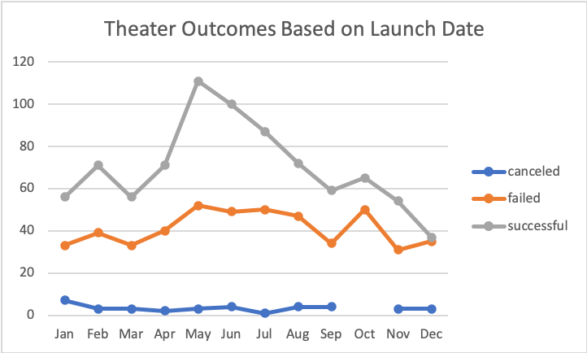
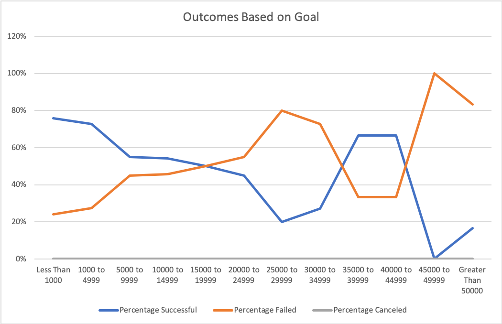

# An Analysis of Kickstarter Campaigns
## Overview of Project
### Purpose
The purpose of this analysis is to show the trends of kickstarter campaign data, more specifically theater and play kickstarter campagin data throughout the years. Our client is looking to start her own play, *Fever*, in the upcoming future and wants to know when the best time to launch her play and how her goal amount compared against other campaigns. 
## Analysis and Challenges
### Analysis of Outcomes Based on Launch Date
The outcomes based on launch dates for the theater category have been mostly successful. As you can see from the *Theater Outcomes Based on Launch Date* graph, more than 50% of theater productions launched have been successful. The most successful time frame has been when theater would launch in May, with June and July still higher the other nine months. The best time to launch a new theater production would be in the summer months, such as May, June, and July; and the worst months to launch a theater piece would be December and January. 
#### Graph 1.1

### Analysis of Outcomes Based on Goals 
The outcomes based on goal amounts have mostly even percentages, between the successful projects and the failed projects. The goals of the campaigns that were the most successful were the budgetary goals with a $1000 or less, with a percentage of 76% success rate. The campaign goals with the most failures were the budgetary goals range of $45,000 to $49,999.  The *Outcomes Based on Goal* graph shows each of the budget ranges and how they compare with success rate and failure rate. 
#### Graph 1.2

### Challenges and Difficulties Encountered
The biggest challenge I faced was the 
## Results
Some conclusions about the Outcomes Based on Launch Date is the second quarter of the year is the best time to launch a new theater production. The summer months are when more people take off of work and have more time to committ to those productions. Also, the second quarter the most popular times to launch a new theater production, whether it was success or failed, so that goes with my result of launching the production in the summer months. 

A conclusion about the Outcomes Based on Goals was that the majority of goals were in the range of $1000 to $4,999, with 73% of the total projects being successful. With our client's goal of $10,000, she has around 54% of being successful, but I believe if she were to launch her play in the second quarter of the year, she will be successful in her endeavors.  
